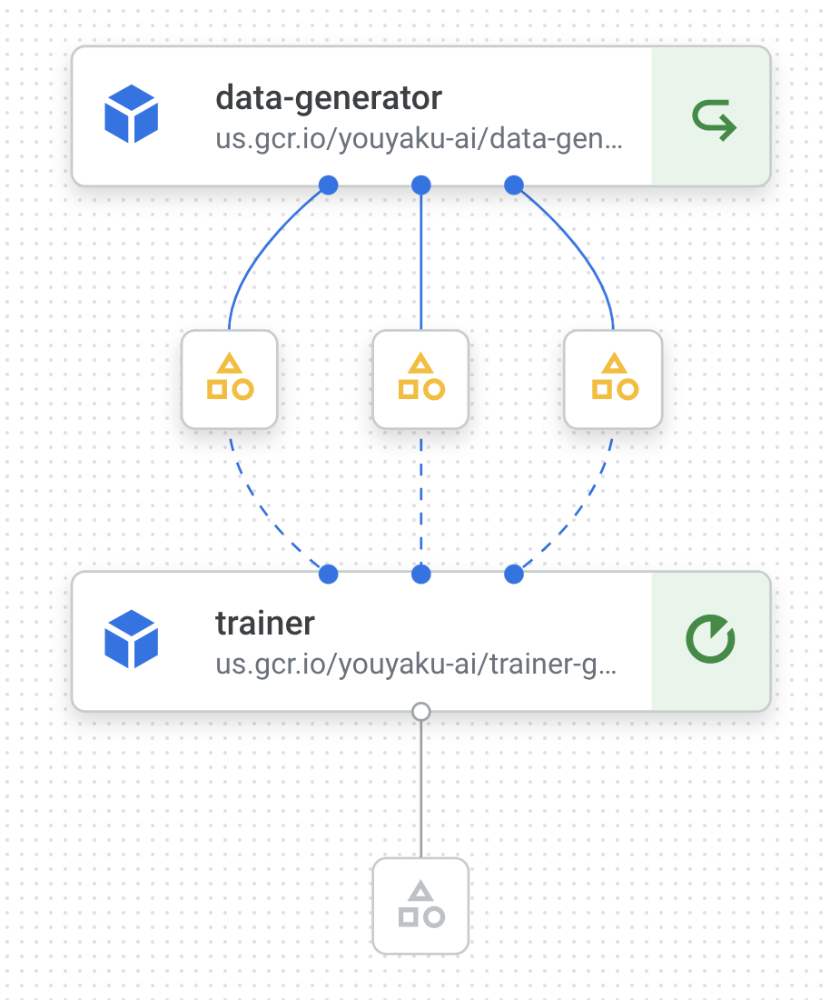

# Model Pipeline

要約AIで用いるモデルを構築するための手順を下記に記載します.<br>
※GCP前提での手順となります。ローカルでの実行手順は別で記載します.

## Setup VertexAI Environment

VertexAIを用いた学習パイプラインを構築するため、下記のような手順で環境を構築してください。

* Googleプロジェクトの作成
* VertexAIの有効化
* gcloud SDKのインストール
* サービスアカウントの作成
* サービスアカウントのcredentialファイルの取得(ルートのcredentials配下に格納)
* VertexAI Pipelineで用いるGCS（Google Cloud Storage）のバケット作成

詳細な手順は下記に纏まっています.
https://cloud.google.com/vertex-ai/docs/pipelines/configure-project

## Modify Environment Parameter for GCP

GCPの環境に合わせて、下記のパラメーターを修正します。

* deploy.yml
  * docker.GCR.project_id : Google Container Registoryで用いるプロジェクト名
  * docker.GCR.docker_host_name : Google Container Registoryで用いるhost name
  * pipeline.GCP.project_id : GCPで用いるプロジェクト名
  * pipeline.GCP.region : GCPで用いるリージョン名（VertexAIで用いる）
  * pipeline.GCP.service_account_prefix : VertexAIパイプラインを動作させるサービスアカウント名

* makefile
  * GOOGLE_PROJECT_ID : GCPで用いるプロジェクトID（deploy.ymlと同一のプロジェクトIDにすること)
  * GOOGLE_MAIL : GCPで用いているオーナー権限をもつメールアドレス

## Push Docker into GCR(Google Container Registory)

Pipelineで用いるDocker ImageをGCRにプッシュします.<br>
本リポジトリのルートフォルダで下記コマンドを実施してください.

```
$ make build-push-component
```

## Execute Pipeline

Pipelineの実行は下記コマンドをルートフォルダで実行してください.

```
$ make run-pipeline
```

下記のようにPipelineが実行されます.<br>
※Google ConsoleのVertexAIのPipeline画面から確認が可能です.



また、Pipelineのビルドのみを実施する場合は、下記コマンドを実行してください.

```
$ make build-pipeline
```

## Check Result and Output

GCS (Google Cloud Storage)上に,下記ファイルがそれぞれ作成されます.

* 学習、テスト用のデータファイル(csv)
* モデルファイル
